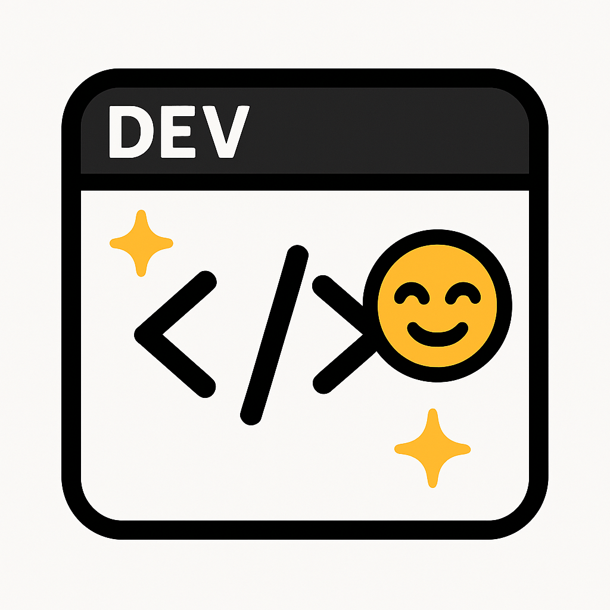

# Dev.to Syntax
Your goofy, epic syntax enhancer for VSCode. Inspired by dev.to, built for rebels.
Auto-configure VSCode to mimic dev.to code block styling.

## Features

- Sets editor font to **Fira Code** with ligatures.
- Applies a light, clean color theme modeled on dev.to’s code blocks.
- Recommends and installs:
  - Material Icon Theme
  - Bracket Pair Colorizer 2
  - Indent Rainbow

## Installation

1. Clone repo  
   ```bash
   git clone https://github.com/nia-cloud-official/devto-syntax.git
   cd devto-syntax
   ```
2. Install dependencies  
   ```bash
   npm install
   ```
3. Build and package  
   ```bash
   npm run package
   ```
4. Install VSIX  
   ```bash
   code --install-extension devto-syntax-1.0.0.vsix
   ```

or Simply search for "Dev.to Syntax" in vscode extension marketplace
## Usage

Once installed and reloaded, Dev.to Syntax will:

- Change your font settings to Fira Code and enable ligatures.
- Switch to the Dev.to Syntax color theme.
- Recommend/install supporting extensions.

Enjoy dev.to’s cozy code vibes in VSCode—no manual steps required!
```

