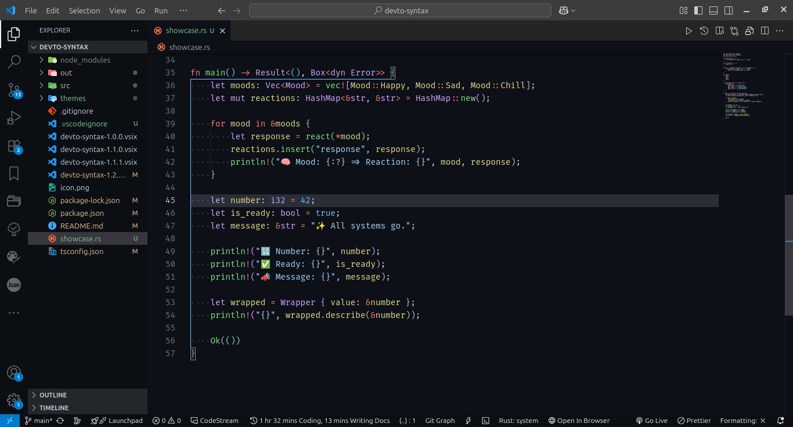

<h1>
  
  Dev.to Syntax
</h1>

Make VSCode feel like dev.to code blocks — with an optional Copilot-style split UI. Auto-sets Fira Code ligatures, ergonomic editor defaults, and clean, readable colors.

<p align="center">
  
</p>


## Features
- Dev.to-inspired dark theme for the editor
- Split UI and Copilot UI variants (dark sidebar + light editor)
- Fira Code ligatures, bracket pair colorization, clear indentation
- Material Icon Theme dependency for crisp icons

## Theme Options
- Dev.to Syntax (dark)
- Dev.to Syntax (Split UI)
- Dev.to Syntax (Copilot UI)


Pick via:
1. Command Palette → “Color Theme”
2. Or run: “Dev.to Syntax: Pick Theme Variant”


---

## Notes

- The extension sets ergonomic defaults and offers a first-run theme picker. Users can always override settings.
- Fonts can’t be auto-installed by an extension. The setup enables ligatures and points users to Fira Code if missing.
- If you want me to tighten any specific color or contrast for your display, name it and I’ll tune the hex values.

## Installation

1. Clone repo  
   ```bash
   git clone https://github.com/nia-cloud-official/devto-syntax.git
   cd devto-syntax
   ```
2. Install dependencies  
   ```bash
   npm install
   ```
3. Build and package  
   ```bash
   npm run package
   ```
4. Install VSIX  
   ```bash
   code --install-extension devto-syntax-1.0.0.vsix
   ```

or Simply search for "Dev.to Syntax" in vscode extension marketplace

## Usage

Once installed and reloaded, Dev.to Syntax will:

- Change your font settings to Fira Code and enable ligatures.
- Switch to the Dev.to Syntax color theme.
- Recommend/install supporting extensions.

Enjoy dev.to’s cozy code vibes in VSCode—no manual steps required!

